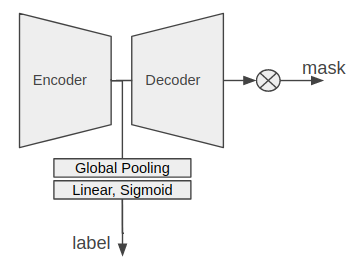

# Kaggle Cloud Segmentation

__Competitions:__ [Understanding Clouds from Satellite Images](https://www.kaggle.com/c/understanding_cloud_organization)  
__Rank:__ 72/1538 (Top 4.6%, silver) 
__Task:__ Image multi-class segmentation  
__Data:__ trainset:5546 2100\*1400 cloud images, testset:3698 2100\*1400 cloud images  
__Note:__ This is a code backup, it's not runable due to the difference file path  


## Solution  

1. __数据增强__
	* 综合显存限制和实验效果，最终选择resize到480*640  
	* 随机4方向翻转(HorizontalFlip, VerticalFlip)  
	* 随机平移旋转(ShiftScaleRotate)  
	* 模糊(Blur)  
	* 形变(GridDistortion)  
2. __交叉验证__
	* 选择5fold交叉验证，减小过拟合风险  
	* 所有步骤，哪怕不同的stage，也要严格遵守同一份cv，避免泄露  
3. __模型__
	* [segmentation_models.pytorch](https://github.com/qubvel/segmentation_models.pytorch)  
	* 模型结构采用了Unet和FPN (FPN效果稍好)  
	* Decoder尽可能多的选择不同与训练模型(resnet, densenet, efficientnet etc.)  
	* 增加classify模型，预测图片中是否含有某种云层，若不含，直接忽略segment的输出  
4. __Loss__  
   * FocalLoss2d + DiceLoss  
5. __后处理__
   * 删除面积较小的mask  
   * 将mask转换成规则的多边形(因为训练数据中的mask比较规则)  
   * 阈值搜索(3个阈值-classify, segment, min_mask_area)  
6. __模型融合__：
   * stacking with TTA
   * 直接取平均    
   * 直接取max  
   * 取均值和max的均值（效果最好）

##  TODO

1. 尝试更多的模型结构 DeepLab, SegNet etc.  
2. 因为在Dice评判标准中FP和FN的影响程度是不一样的, 高FP带来的效果比FN糟糕，所以在像素点模棱两可的情况下宁可将其判断成正类也优于负类  
   * Weighted Loss：BCELoss或 FocalLoss中赋予不同的判错权重  
   * 更合理的模型融合方法：取均值太保守，取max太激进  


## File Discribe
```
-------- data_preprocess.py: preprocess with resize, 缩短训练时间
  |
  |----- dataset.py: override Pytorch DataSet
  |
  |----- global_parameter.py: global parameters
  |
  |----- generate_kfold.py: generate kfold.pkl
  |
  |----- loss.py: FocalLoss2d & DiceLoss
  |
  |----- models.py: classify models
  |
  |----- train_cls_multiGPU.py: train classify models
  |
  |----- strain_seg_multiGPU.py: train segment models
  |
  |----- vi_cls_tta.py: validate & inference classify models with tta
  |
  |----- vi_seg_tta.py: validate & inference segment models with tta
  |
  |----- train_*_onefold.py: train models in one fold (use for fintuning)
  |
   ----- utils.py: utils functions


```


## Top Rank Solution  
[1st palce solution](https://www.kaggle.com/c/understanding_cloud_organization/discussion/118080#latest-679820):  

1. multi task model  

   

2. segment model 只在non-empty上训练(用 label mask output)  

3. seg prob取topK的均值; cls prob取max  

[2nd place solution](https://www.kaggle.com/c/understanding_cloud_organization/discussion/118255#latest-680162):  

1. 不直接resize图片，而是用几个Conv去缩小图片，Conv跟随网络一起训练。这样做保留了更丰富的图片信息  
2. 为了保证ensemble模型之间的差异性，设计了比较科学的训练配置：每次使用不同的size, modle, decoder etc.   
3. 用了更丰富的data augmentation(这个需要实验论证)  

[16th place solution](https://www.kaggle.com/c/understanding_cloud_organization/discussion/118065#latest-678494):

1. CutMix augmentation: cut a part of this image and paste to another image  
2. Pseudo-Label: 在testset里选取置信比较高的样本加入train（比较难控制需要初始模型较优，选取的比较好的话可以带来可观的提升）  